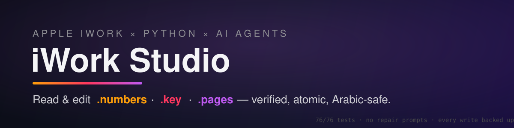

<div align="center">



[](.github/workflows/ci.yml)
[](LICENSE)
[](#capability-matrix)
[](#arabicrtl)
[](#mcp-server)
[](#drop-in-skill)
[](#the-safety-model)

**Give your AI agent the keys to Apple iWork.** Read and edit **Numbers (`.numbers`)**, **Keynote (`.key`)** and **Pages (`.pages`)** files — with verified writes, versioned backups, one-call undo, and Arabic/RTL fidelity that actually holds. Ships as an **MCP server**, a Python library, and a drop-in agent skill.

[Install](#install) · [The safety model](#the-safety-model) · [Capability matrix](#capability-matrix) · [MCP server](#mcp-server) · [Traps we mapped](#traps-we-mapped-so-you-dont-die-on-them)

<br>

<a href="https://arkanji.com/images/posts/iwork-studio-film-v3.mp4">
  
</a>

<sub>▶ <a href="https://arkanji.com/images/posts/iwork-studio-film-v3.mp4"><b>Watch the full film with sound</b></a> (46s) · <a href="https://arkanji.com/posts/iwork-studio-launch/">Read the launch story</a></sub>

</div>

---

## Why this exists

Microsoft documents have great open tooling (python-docx, python-pptx, openpyxl — even official agent skills). **Apple iWork has none.** No public format spec, no maintained `.pages` parser, and AppleScript that quietly refuses to save outside its sandbox. AI agents asked to "fix slide 3" or "update cell B2" either hallucinate support or corrupt your files.

**iWork Studio is the missing piece**: honest capability boundaries and hard safety gates. Where a route does *not* exist, we say so. Where one exists, it has to pass its gates on every single write.

```python
from iwork_studio import numbers_io, keynote_io, keynote_slides, backups

model = numbers_io.read_numbers("revenue.numbers")             # full semantic model
numbers_io.edit_cell("revenue.numbers", "B2", 2500, sheet="Budget")   # backed up, verified, atomic
keynote_io.edit_text("pitch.key", "2024", "2025")              # deck-wide, formatting untouched
keynote_slides.set_presenter_notes("pitch.key", 1, "ملاحظات")   # via Keynote, every other slide checked
backups.restore_backup("revenue.numbers", backups.list_backups("revenue.numbers")[0]["name"])  # undo
```

## Install

> **AI agent setting this up for a user?** Use the row for the user's app below, then call `iwork_capabilities`. Everything you need is in this section; [`AGENTS.md`](AGENTS.md) has the usage rules.

| Your app | Do this |
|---|---|
| **Claude desktop app** (Mac) | Paste in Terminal: `curl -LsSf https://raw.githubusercontent.com/Arkanji/iwork-studio/main/install.sh \| sh` — then quit Claude (Cmd-Q) and reopen |
| **Claude Code** | `claude mcp add iwork-studio -- uvx --from git+https://github.com/Arkanji/iwork-studio iwork-studio-mcp` |
| **Cursor, VS Code, Codex, any MCP client** | Run `uvx --from git+https://github.com/Arkanji/iwork-studio iwork-studio-mcp config` and paste the JSON it prints into the client's MCP settings |

- **Nothing else to install.** The installer sets up [`uv`](https://docs.astral.sh/uv/) if it's missing, and uv fetches its own Python. Don't install Python yourself.
- **Optional fence** (recommended): only let it touch certain folders — `… | sh -s -- --roots ~/Documents ~/Desktop`. Other MCP clients: set `IWORK_STUDIO_ROOTS` to the folders, separated by `:`.
- **Remove it:** `uvx --from git+https://github.com/Arkanji/iwork-studio iwork-studio-mcp uninstall`

### First run on a Mac

1. **Check it's there:** ask Claude *"what can iwork-studio do on this Mac?"* — it calls `iwork_capabilities`. The very first start downloads ~60 MB, so give it a minute.
2. **One permission prompt:** the first time it drives Keynote, Pages or Numbers, macOS asks *"Claude wants to control Keynote"* (or your terminal's name in Claude Code). Click **OK**. Clicked *Don't Allow* by mistake? System Settings → Privacy & Security → **Automation** → turn it on.
3. **Close the file in its app** before slide operations — they refuse a document that is open, so they never close a window with unsaved work.
4. **Something wrong?** The log is `~/Library/Logs/Claude/mcp-server-iwork-studio.log`.

### Then just ask, in English or Arabic

> *"Change 2025 to 2026 on every slide of ~/Decks/pitch.key"*
> *"Duplicate slide 3, move the copy to the front, and add Arabic presenter notes: ملاحظات المتحدث"*
> *"Set B2 in budget.numbers to 2500, then show me the backups"*
> *"Undo the last change to pitch.key"*

**What needs what:** `.numbers` and `.key` text reads and edits work anywhere, even without the apps. Pages, slide operations and render checks drive the real app on a Mac (classic iWork or the Creator Studio apps).

## The safety model

An iWork app will happily say "saved" about a file it just broke. So no write here trusts "saved". Every write, through every entry point (library, CLI, MCP):

```
versioned backup → change a scratch copy → re-open + check it → atomic swap → (optional) render-verify
        ↘ any check fails: your file is untouched, the error says why
```

- **Backup first**, timestamped, next to the file (`<file>.backups/`).
- **The scratch copy is re-read and compared**: exactly the requested change happened and nothing else did. A cell edit checks every other cell; a deck replace checks structure and every text; a slide op checks every other slide, in order.
- **Atomic swap**: the file is replaced in one step, so a crash can't leave half a file.
- **Undo is a tool call**: `iwork_list_backups` / `iwork_restore_backup`. A restore is re-parse-gated and backs up the current version first, so it is undoable too.
- **Never trust the app's "ok"**: scripting bridges report success for writes that did nothing — ignored properties, duplicates landing in another document, no-op moves. Every app-driven write is re-read from disk; "said ok, nothing changed" ends in rollback, never in a fake success.
- **Refuse, don't mangle**: files with charts are refused for writes; Pages edits beyond the two supported ops are refused. The worst case is a clear "no", never a broken file.

Why it matters: an agent edits files with nobody watching each edit. Without these gates, a bad edit silently corrupts a client deck or scrambles Arabic while the agent reports "done".

## Capability matrix

Full table: [`skill-pack/references/capability-matrix.md`](skill-pack/references/capability-matrix.md).

| Format | Route | Read | Write | Charts | Arabic/RTL | Render-verify |
|---|---|:---:|:---:|:---:|---|---|
| `.numbers` | `numbers-parser` 4.19.0 — pure Python, headless | ✅ full model (sheets→tables→cells, formulas, styles, formats) | ✅ cell edits, styles, number formats, borders, widths/heights, headers, merges — atomic | 🚫 refused, not mangled | ✅ byte-exact codepoints | ✅ PDF → text layer |
| `.key` text | `keynote-parser` 1.14.5.0 — pure Python (+ AppleScript fallback in app) | ✅ slide/text-item tree | ✅ deck-wide find/replace — atomic | 🚫 refused, not mangled | ✅ `\u06xx` escape-aware | ✅ PDF → text layer |
| `.key` slides | AppleScript via live Keynote (GUI session) | ✅ per-slide inventory | ✅ add · duplicate · delete · move · skip · presenter notes ¹ | 🚫 refused | ✅ notes Arabic-safe | ✅ PDF → text layer |
| `.pages` | AppleScript via live Pages (GUI session) | ✅ body text, export to `.docx`/PDF | ⚠️ `replace_all`, `set_body` only — richer ops raise `PagesOutOfScopeError` | n/a | ✅ preserved end-to-end | ✅ PDF → text layer |

¹ **On by default.** Each slide op runs the full safety model plus a per-slide expectation gate: if Keynote does anything other than the requested change, the deck is rolled back byte-exact. Refuses a deck that is open in Keynote (it never closes a window that may hold unsaved edits) and never deletes the last slide. Off switch: `IWORK_STUDIO_DISABLE_SLIDE_OPS=1`.

> **The `.pages` honesty clause:** there is *no* pure-Python `.pages` parser anywhere. Rather than fake it, we ship exactly the two app-driven ops that pass their gates and fail loudly on everything else. Inventing `.pages` support would be a corruption vector, not a feature.

### Arabic/RTL

- `.numbers`: `أحمد` written, saved, re-parsed → exact same codepoints
- `.key`: `\u06xx` escape sequences survive find/replace intact
- Render level: single-word, ligature-aware PDF assertions (multi-word Arabic extracts from PDF text layers in visual bidi order and produces false mismatches, so we assert one word by rule)
- RTL marks (U+200F) survive the full edit loop
- Values are stored exactly as written: Arabic-Indic digits (`١٢٣٫٤٥`), `٪١٥`, `"$1,234.56"`, European decimals and `=…` text stay strings — no silent auto-conversion (the Numbers *app* does convert these; our parser route doesn't)
- Presenter notes in Arabic round-trip exactly through Keynote

## MCP server

`iwork-studio-mcp` exposes the library over MCP (stdio). Every tool is a thin wrapper, so the safety model is not optional: an agent cannot reach a write that skips the backup, the check or the atomic swap.

| Tool | What it does |
|---|---|
| `iwork_capabilities` | What this machine can do right now: GUI session, installed apps, slide-op status |
| `iwork_read` | `.numbers` / `.key` / `.pages` → JSON model |
| `numbers_edit_cell` | One cell; every other cell verified unchanged |
| `numbers_inspect_format` | Current widths, heights, headers, merges, and per-cell font/colour/fill/alignment/number format/borders |
| `numbers_set_cell_style` · `numbers_set_number_format` · `numbers_set_borders` | Fonts, bold/italic, colours, fill, alignment, wrap · currency (e.g. `SAR 1,234.50`), %, decimals, red negatives, dates · borders (all/outline/inner) |
| `numbers_set_dimensions` · `numbers_set_headers` · `numbers_merge_cells` | Column widths and row heights · header rows/columns · merges (refused if they would hide data) |
| `keynote_replace_text` | Deck-wide find/replace; structure verified unchanged |
| `keynote_add_slide` · `keynote_duplicate_slide` · `keynote_delete_slide` · `keynote_move_slide` · `keynote_skip_slide` · `keynote_set_presenter_notes` | Slide ops via Keynote; every other slide verified unchanged |
| `pages_preflight` · `pages_replace_all` · `pages_set_body` | The two Pages ops |
| `iwork_verify_render` | Export PDF through the app, assert the text is visibly there |
| `iwork_verify_format` | Export PDF through the app, assert the text is drawn with the expected font, size, colour, bold and page size |
| `iwork_list_backups` · `iwork_restore_backup` | Undo: every write's versioned backup, restored atomically |

- Writes carry `destructiveHint` and reads carry `readOnlyHint`, so clients can ask before writing.
- Optional fence: `IWORK_STUDIO_ROOTS` (folders separated by `:`, `~` allowed) keeps the server inside the folders you name; the installer's `--roots` sets it for you.
- The protocol stream stays clean: library chatter (keynote-parser progress, PyMuPDF warnings) goes to stderr, never into the JSON-RPC wire — covered by a test.

## Traps we mapped so you don't die on them

Hard-won on a live machine, so your agent doesn't learn them by corrupting something:

1. **The sandbox `save in` trap** — iWork apps are sandboxed; `save in <arbitrary path>` from AppleScript is **DENIED**. In-place `save` works; `export` works. A script doing this is a bug, not a retry. → [`sandbox-trap.md`](skill-pack/references/sandbox-trap.md)
2. **Keynote 15.4 `-1700` defect** — the documented `title`/`body` slide properties throw `-1700`. Working form: `object text` of a text item. → [`keynote-1700-defect.md`](skill-pack/references/keynote-1700-defect.md)
3. **Python 3.14 Pillow hijack** — a broken Pillow leaking into venvs breaks `keynote-parser` with `PIL._imaging` errors; clean 3.12 envs avoid it. → [`pins.txt`](skill-pack/references/pins.txt)
4. **Chart files are refused, not mangled** — text edits on chart files risk corrupting chart data references (chart message types checked against Apple's own templates). Every writer detects and refuses.
5. **Strict byte-equality on save is a myth** — IWA protobuf re-encoding is opaque; the real bar is *semantic* equality (reopens with zero repair prompts, full model compared). We enforce the real bar and name the fake one.
6. **TCC + template chooser first-run walls** — one-time permission prompts; a preflight makes agents fail with guidance instead of hanging. → [`tcc-preflight.md`](skill-pack/references/tcc-preflight.md)
7. **"Creator Studio" is a different app** — iWork 15.1+ can install as `Numbers Creator Studio.app` etc.; a hardcoded `Application("Numbers")` drives the wrong app. Names are resolved per call and the classic app is preferred. Numbers, Pages and Keynote Creator Studio are supported; an unknown Creator Studio app is refused with guidance. → [`apps.py`](src/iwork_studio/apps.py)
8. **stdout is the MCP wire** — `import fitz` prints a deprecation warning and keynote-parser prints progress, both on stdout. In an MCP server that corrupts the protocol. We import `pymupdf` and keep import-time output off the wire.
9. **Keynote JXA insert/move are broken on Creator Studio** — `slides.splice(...)` fails with `-10002`, and JXA `move` doesn't do what it says. Native AppleScript (`make new slide`, `move slide n to before/after slide t`) works, and that's what we use.
10. **Don't keep the repo in iCloud** — Desktop/Documents sync creates "name 2" conflict copies inside `.git` (`fatal: bad object refs/heads/main 2`). Clone to a non-synced folder.

Plus ~25 more scripting traps imported (each marked by status, not taken as gospel) from [reichenbach/iwork_mcp](https://github.com/reichenbach/iwork_mcp): colour ranges per app, PostScript font names, Numbers auto-parsing `"$1,234"`, Pages tables only reachable from AppleScript, and more → [`jxa-traps.md`](skill-pack/references/jxa-traps.md)

## For AI agents

### Any agent, any tool

- **[`AGENTS.md`](AGENTS.md)** — the cross-tool instruction file (Codex, Cursor, Copilot, Gemini, Claude Code via `CLAUDE.md`): which interface to use, what each route needs, the rules.
- **MCP server instructions** — sent to the client on connect, so the model gets the rules even without this repo.
- **Skill** — [`skill-pack/SKILL.md`](skill-pack/SKILL.md), standard frontmatter (`name`, `description`), auto-discovered by Claude Code here via `.claude/skills/`.

### Drop-in skill

[`skill-pack/SKILL.md`](skill-pack/SKILL.md) is a self-describing skill any agent framework can load (Hermes, Claude-style systems, anything with a `skills/` directory):

```bash
bash skill-pack/install.sh          # installs to $HERMES_HOME/skills/iwork-studio (default ~/.hermes/skills)
```

### For crawlers and LLMs (`llms.txt`)

Machine-readable manifest for AI discovery: [`llms.txt`](llms.txt) — summary, routes, install, honest limitations. Serve it from `/.well-known/llms.txt` if you host docs for this.

### Agent contract

- **JSON in / JSON out** on every script and tool — stderr is never part of the contract
- **Typed, fail-loud errors**: `ChartRefusalError`, `PagesOutOfScopeError`, `FileLockedError`, `DocumentOpenError`, `SchemaDriftError`, `SlideOpVerificationError`, `CreatorStudioUnverifiedError`, `AquaSessionError`
- **Headless fails fast** with guidance (app routes need a GUI session — detected, not discovered the hard way)
- **Pinned dependencies**: one source of truth, enforced by a test

## Architecture

```
file-level parsers (deterministic, headless, diffable)  →  .numbers, .key text
app-level AppleScript (the app is the renderer of record) →  .key slides, .pages, render-verify
MCP server / CLI / skill                                  →  thin wrappers over the same library
```

Hybrid by design: file-level where determinism wins, app-level only where the app owns the truth. Every write rides the same safety model.

## Repository layout

```
src/iwork_studio/     numbers_io · keynote_io · keynote_slides · keynote_applescript · pages_io
                      render_verify · backups · apps · mcp_server
skill-pack/           SKILL.md · install.sh · CLI scripts · references/ (matrix, traps, pins)
tests/                pytest + fixtures/ — headless lane in CI · `pytest -m aqua` = live Mac lane
install.sh            one-line setup for the Claude desktop app
scripts/              probe_keynote_slides.py — check slide ops against your own Keynote (throwaway copies)
.github/workflows/    ci.yml — headless tests on every push and PR
.mcp.json             project MCP config (Claude Code picks it up here)
AGENTS.md · CLAUDE.md agent instructions (Codex, Cursor, Copilot, Gemini, Claude Code)
.claude/skills/       the skill, auto-discovered by Claude Code in this repo
assets/               banner + media
```

## For developers

**Library** (Python 3.12):

```bash
git clone https://github.com/Arkanji/iwork-studio.git
cd iwork-studio
uv sync --extra test        # or: python3.12 -m venv .venv && pip install -e ".[test]"
```

```python
from iwork_studio import numbers_io, keynote_io, keynote_slides, backups
```

Inside a clone, Claude Code picks up the project [`.mcp.json`](.mcp.json) automatically (contributors only — it points at the local checkout).

**CLI** (JSON on stdout, safe to pipe):

```bash
python skill-pack/scripts/read.py revenue.numbers            # .numbers / .key / .pages
python skill-pack/scripts/edit_numbers.py edit-cell revenue.numbers --ref B2 --value 2500
python skill-pack/scripts/edit_key.py replace pitch.key "2024" "2025"
python skill-pack/scripts/verify_render.py pitch.key --assert-text "الإيرادات"
```

## Contributing

iWork versions drift. If this breaks on a future macOS/iWork release, the failure mode is usually *documented renames*: check the [capability matrix](skill-pack/references/capability-matrix.md) and [traps](skill-pack/references/jxa-traps.md), run `pytest -m aqua` and `scripts/probe_keynote_slides.py` on a Mac (clone outside iCloud-synced folders), and pin the new reality. PRs that add a route *with its gates and tests* are the PRs we want.

## Star history, honestly

This started because an AI butler was asked to edit a Keynote slide and the ecosystem had nothing to offer him. If it saved your agent from corrupting a deck, consider starring — it helps others find the traps.

## License

[MIT](LICENSE) — including the traps. Take them.
